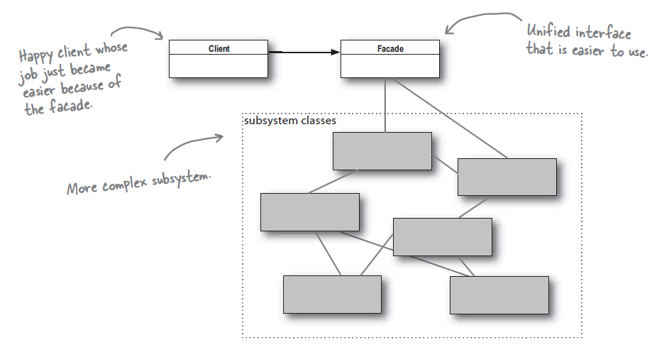

# behavioral_patterns

## 퍼사드 패턴

- 퍼사드 : 입구쪽에서 보는 건물의 전경
- 



### 예시
- 메일 전송 프로그램
```java
public class Client {

    public static void main(String[] args) {
        String to = "keesun@whiteship.me";
        String from = "whiteship@whiteship.me";
        String host = "127.0.0.1";

        Properties properties = System.getProperties();
        properties.setProperty("mail.smtp.host", host);

        Session session = Session.getDefaultInstance(properties);

        try {
            MimeMessage message = new MimeMessage(session);
            message.setFrom(new InternetAddress(from));
            message.addRecipient(Message.RecipientType.TO, new InternetAddress(to));
            message.setSubject("Test Mail from Java Program");
            message.setText("message");

            Transport.send(message); // 너무 많은 정보를 지니고 있음 (커플링 ↑)
        } catch (MessagingException e) {
            e.printStackTrace();
        }
    }
}
```
▼
```java
public class EmailSettings {

    private String host;

    public String getHost() {
        return host;
    }

    public void setHost(String host) {
        this.host = host;
    }
}
public class EmailMessage {

    private String from;

    private String to;
    private String cc;
    private String bcc;

    private String subject;

    private String text;
    
    // 게터, 세터...
}
public class EmailSender {

    private EmailSettings emailSettings;

    public EmailSender(EmailSettings emailSettings) {
        this.emailSettings = emailSettings;
    }

    /**
     * 이메일 보내는 메소드
     * @param emailMessage
     */
    public void sendEmail(EmailMessage emailMessage) {
        Properties properties = System.getProperties();
        properties.setProperty("mail.smtp.host", emailSettings.getHost());

        Session session = Session.getDefaultInstance(properties);

        try {
            MimeMessage message = new MimeMessage(session);
            message.setFrom(new InternetAddress(emailMessage.getFrom()));
            message.addRecipient(Message.RecipientType.TO, new InternetAddress(emailMessage.getTo()));
            message.addRecipient(Message.RecipientType.CC, new InternetAddress(emailMessage.getCc()));
            message.setSubject(emailMessage.getSubject());
            message.setText(emailMessage.getText());

            Transport.send(message);
        } catch (MessagingException e) {
            e.printStackTrace();
        }
    }
}


public class Client {

    public static void main(String[] args) {
        EmailSettings emailSettings = new EmailSettings();
        emailSettings.setHost("127.0.0.1");

        EmailSender emailSender = new EmailSender(emailSettings); // 클래스 의존성은 어쩔 수 없음

        EmailMessage emailMessage = new EmailMessage();
        emailMessage.setFrom("keesun"); // 스태틱 메서드를 이용하던 라이브러리 의존성이 사라짐 
        emailMessage.setTo("whiteship");
        emailMessage.setCc("일남");
        emailMessage.setSubject("오징어게임");
        emailMessage.setText("밖은 더 지옥이더라고..");

        emailSender.sendEmail(emailMessage);
    }
}
```

### 장점
- 서브시스템에 대한 의존성을 한 곳으로 몰아 둘 수 있음
    - 클라이언트 코드를 읽기 편해짐
    - 클라이언트가 많을 수록 장점이 됨
    
### 단점
- 퍼사드가 서브시스템의 모든 의존성을 지니게 됨

### 자바와 스프링에서의 예시
- 스프링
    - MailSender - JavaMailSenderImpl
    - PlatformTransactionManager - JdbcTransactionManager
        ```java
        public class FacadeInSpring {
        
            public static void main(String[] args) {
                MailSender mailSender = new JavaMailSenderImpl();
        
                PlatformTransactionManager platformTransactionManager = new JdbcTransactionManager();
            }
        }
        ```
    - Spring MVC (서블릿 뿐만 아니라 리액티브 스트림도 받을 수 있음)
