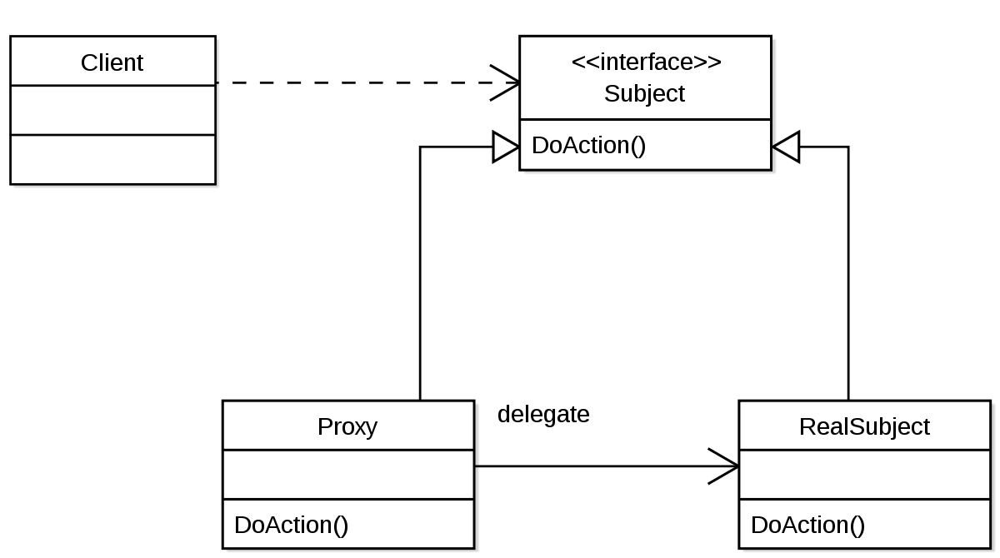

# behavioral_patterns

## 프록시 패턴

- 특정한 객체에 대한 기능을 추가할 수 있는 패턴
    - 접근 제어, 레이지 로딩, 로깅, 캐싱 등 가능



### 예시
- 게임 실행 프로그램
```java
public class Client {

    public static void main(String[] args) throws InterruptedException {
        GameService gameService = new GameService();
        gameService.startGame();
    }
}
```
▼
```java
public class GameServiceProxy implements GameService {

    private GameService gameService;

    @Override
    public void startGame() {
        long before = System.currentTimeMillis();
        if (this.gameService == null) {
            this.gameService = new DefaultGameService();
        }

        gameService.startGame();
        System.out.println(System.currentTimeMillis() - before);
    }
}

public class Client {

    public static void main(String[] args) {
        GameService gameService = new GameServiceProxy();
        gameService.startGame();
    }
}
```

### 장점
- 기존 코드를 변경하지 않고 새로운 코드 추가 가능 → 개방폐쇄원칙
- 기존 코드가 하는 일만 유지할 수 있음 → 단일책임원칙
    
### 단점
- 코드가 조금 복잡해 질 수 있음

### 자바와 스프링에서의 예시
- 자바
    - DynamicProxy (동적으로 프록시 이용)
        ```java
        public class ProxyInJava {
        
            public static void main(String[] args) {
                ProxyInJava proxyInJava = new ProxyInJava();
                proxyInJava.dynamicProxy();
            }
        
            private void dynamicProxy() {
                GameService gameServiceProxy = getGameServiceProxy(new DefaultGameService());
                gameServiceProxy.startGame();
            }
        
            private GameService getGameServiceProxy(GameService target) {
                return  (GameService) Proxy.newProxyInstance(this.getClass().getClassLoader(),
                        new Class[]{GameService.class}, (proxy, method, args) -> {
                            System.out.println("O");
                            method.invoke(target, args);
                            System.out.println("ㅁ");
                            return null;
                        });
            }
        }
        ```
- 스프링
    - Spring AOP
        ```java
        @Aspect
        @Component
        public class PerfAspect {
        
            @Around("bean(gameService)")
            public void timestamp(ProceedingJoinPoint point) throws Throwable {
                long before = System.currentTimeMillis();
                point.proceed();
                System.out.println(System.currentTimeMillis() - before);
            }
        }
        ```
        - @Transactional, 캐시 등