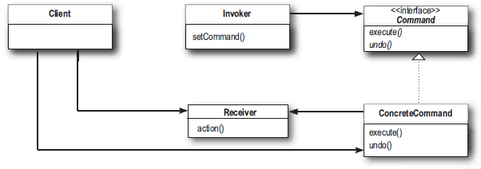

# behavioral_patterns

## 커맨드 패턴

- 요청을 캡슐화하여 호출자(invoker)과 수신자(receiver)를 분리하는 패턴
    - 요청을 처리하는 방법이 바뀌더라도, 호출자의 코드는 변경되지 않음
  


### 예시
- 불을 켜고, 끄는 기능이 있으며, 게임을 킬 수도 있는 프로그램
```java
public class MyApp {

    private Game game;

    public MyApp(Game game) {
        this.game = game;
    }

    public void press() {
        game.start();
    }

    public static void main(String[] args) {
        Button button = new Button(new Light());
        button.press();
        button.press();
        button.press();
        button.press();
    }
}
```
▼
```java
public interface Command { // Runnable 인터페이스를 사용해도 됨

    void execute();

    void undo();

}

public class Button {

    private Stack<Command> commands = new Stack<>();

    public void press(Command command) {
        command.execute();
        commands.push(command);
    }

    public void undo() {
        if (!commands.isEmpty()) {
            Command command = commands.pop();
            command.undo();
        }
    }

    public static void main(String[] args) {
        Button button = new Button();
        button.press(new GameStartCommand(new Game()));
        button.press(new LightOnCommand(new Light()));
        button.undo();
        button.undo();
    }

}
public class LightOnCommand implements Command {

    private Light light;

    public LightOnCommand(Light light) {
        this.light = light;
    }

    @Override
    public void execute() {
        light.on();
    }

    @Override
    public void undo() {
        new LightOffCommand(this.light).execute();
    }
}
public class GameStartCommand implements Command {

    private Game game;

    public GameStartCommand(Game game) {
        this.game = game;
    }

    @Override
    public void execute() {
        game.start();
    }

    @Override
    public void undo() {
        new GameEndCommand(this.game).execute();
    }
}
public class MyApp {

    private Command command;

    public MyApp(Command command) {
        this.command = command;
    }

    public void press() {
        command.execute();
    }

    public static void main(String[] args) {
        MyApp myApp = new MyApp(new GameStartCommand(new Game()));
    }
}
```

### 장점
- 기존 코드 변경 없이 새로운 커맨드 생성 가능
- 수신자의 코드가 변경되어도 호출자의 코드는 변경되지 않음
- 커맨드 객체를 로깅, DB 저장, 네트워크 전송 등 다양하게 활용 가능
    
### 단점
- 코드가 복잡해짐
