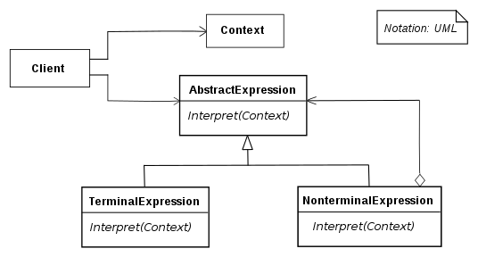

# behavioral_patterns

## 인터프리터 패턴

- 자주 등장하는 문제를 간단한 언어로 정의하고 재사용하는 패턴
    - 반복되는 문제 패턴을 언어 / 문법으로 정의하고 확장 가능
    - ex) 인터프리터 패턴
  

- Expression : 공통 값, Global 값들이 모이는 곳

### 예시
- Postfix 프로그램
```java
public class PostfixNotation {

    private final String expression;

    public PostfixNotation(String expression) {
        this.expression = expression;
    }

    public static void main(String[] args) {
        PostfixNotation postfixNotation = new PostfixNotation("123+-");
        postfixNotation.calculate();
    }

    private void calculate() {
        Stack<Integer> numbers = new Stack<>();

        for (char c : this.expression.toCharArray()) {
            switch (c) {
                case '+':
                    numbers.push(numbers.pop() + numbers.pop());
                    break;
                case '-':
                    int right = numbers.pop();
                    int left = numbers.pop();
                    numbers.push(left - right);
                    break;
                default:
                    numbers.push(Integer.parseInt(c + ""));
            }
        }

        System.out.println(numbers.pop());
    }
}
```
▼
```java
public class App {

    public static void main(String[] args) {
        PostfixExpression expression = PostfixParser.parse("xyz+-a+");
        int result = expression.interpret(Map.of('x', 1, 'y', 2, 'z', 3, 'a', 4));
        System.out.println(result);
    }
}
```

### 장점
- 언어와 문법으로 문제를 정의 가능
- 기존 코드 변경 없이 추가 기능(Expression) 확장 가능
    
### 단점
- 문법이 복잡할수록 코드가 복잡해짐
    - 문법으로 구현하는데 드는 비용을 투자할만 한가?