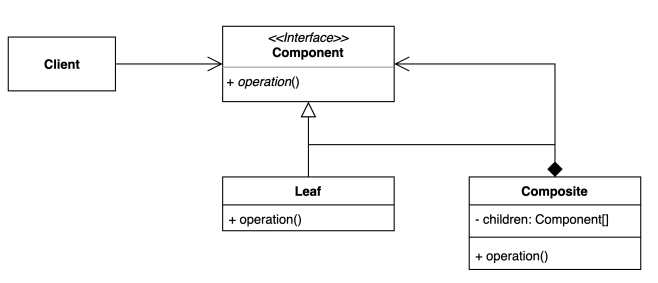

## 컴포짓 패턴 (Composite Pattern)

### 컴포짓 패턴 정의

- 클라이언트 입장에서 전체나 부분이나 모두 동일한 컴포넌트로 인식할 수 있는 계층 구조를 만드는 패턴이다.
- 즉, 클라이언트는 동일한 인터페이스로 전체, 부분 구분없이 다룰 수 있다.
    - OS의 Directory와 File의 관계를 예시로 들 수 있는데, Direcotory(전체)에 File(부분)이 다수 포함되어 있지만 사용자는 이름으로 검색을 하거나 더블 클릭으로 이벤트를 발생시키는
      것은 동일하다.

---

### 컴포짓 패턴의 각 역할 알아보기



- Component
    - 구체적인 부분
    - Leaf 클래스와 Composite 클래스에 공통 인터페이스를 정의
- Leaf
    - 구체적인 부분의 클래스
    - Component에서 정의된 인터페이스의 기능을 구현한다.
    - Composite의 부분으로 구성된다.
- Composite
    - 전체 클래스
    - 복수 개의 Component 구현 클래스 즉, Leaf 클래스 및 Composite 클래스를 유지한다.
    - Component에서 정의된 인터페이스의 기능을 복수의 구현 클래스에게 위임한다.

---

### 컴포짓 패턴을 적용해야하는 상황 살펴보기

- 현재 상황을 클라이언트가 Item의 가격과 Bag에 들어있는 여러 개의 Item 가격의 합을 출력 해야한다고 가정한다.
- 다음 코드를 보면 클라이언트가 Item의 가격을 가져와서 출력하는 메서드와 Bag에 들어있는 Item을 모두 꺼내서 합산해 출력하는 메서드를 하나 씩 정의했다.
- 하지만..
    - Bag이 아니라 캐릭터가 가지고 있는 Item 가격의 합을 출력한다면?
    - 캐릭터가 Bag을 두 개 가지고 있다면?
    - Bag안에 Bag을 넣을 수 있다면?
    - 클라이언트 입장에서 다양한 상황을 다뤄야하기 때문에 복잡도가 증가할 수 있다.
- 위의 상황처럼 다양한 경우에 컴포짓 패턴을 적용하면 클라이언트는 동일한 인터페이스를 사용해서 price를 조회할 수 있다.

```java
public class Client {

    public static void main(String[] args) {
        Item doranBlade = new Item("도란검", 450);
        Item healingPotion = new Item("물약", 50);

        Bag bag = new Bag();
        bag.add(doranBlade);
        bag.add(healingPotion);

        Client client = new Client();
        client.printItemPrice(doranBlade);
        client.printItemPrice(bag);
    }

    private void printItemPrice(Item item) {
        System.out.println(item.getPrice());
    }

    private void printItemPrice(Bag bag) {
        int price = bag.getItems().stream().mapToInt(Item::getPrice).sum();
        System.out.println(price);
    }
}
```

---

### 컴포짓 패턴을 적용하기

- Component는 클라이언트에서 접근하는 Bag과 Item의 공통 인터페이스이다.
- 클라이언트에서 price를 출력하는게 목적이기 때문에 operation은 getPrice() 메서드로 정의한다.

```java
public interface Component {
    int getPrice();
}
```

- Leaf에 해당하는 Item은 Component를 구현한다.
- Item은 Leaf에 해당하는 부분 클래스이기 때문에 인터페이스의 구체적인 기능을 구현한다.

```java
public class Item implements Component {

    private String name;
    private int price;

    public Item(String name, int price) {
        this.name = name;
        this.price = price;
    }

    @Override
    public int getPrice() {
        return this.price;
    }
}
```

- Composite에 해당하는 Bag은 마찬가지로 Component를 구현한다.
- Bag은 Composite에 해당하는 전체 클래스이기 때문에 인터페이스의 구체적인 기능을 부분 클래스에게 위임하여 구현한다.
- Composite은 복수 개의 Component(Leaf 또는 Composite)를 가지기 때문에 component를 추가하거나 제거하는 기능이 있어야한다.

```java
public class Bag implements Component {

    private final List<Component> components = new ArrayList<>();

    @Override
    public int getPrice() {
        return components.stream().mapToInt(Component::getPrice).sum();
    }

    public void add(Component component) {
        this.components.add(component);
    }
}
```

- 컴포짓 패턴을 적용하게 되면 Client는 Component의 구현체의 공통된 인터페이스로 price를 조회할 수 있다.
- 컴포짓 패턴은 Tree 구조 특성이 적용되기 때문에 아래 코드 기준으로 
  - bag의 price를 조회하면 **_도란검, 빨강 물약, 파랑 물약_** 세 개 아이템 가격의 합이 조회되고
  - innerBag의 price를 조회하면 **_파랑 물약_** 한 개의 아이템 가격이 조회된다.

```java
public class Client {

    public static void main(String[] args) {
        Item doranBlade = new Item("도란검", 450);
        Item healingPotion = new Item("빨강 물약", 50);

        Bag bag = new Bag(); <-- 최상위 컴포넌트 구현체
        bag.add(doranBlade);
        bag.add(healingPotion);

        Item manaPotion = new Item("파랑 물약", 50);
        
        Bag innerBag = new Bag();
        innerBag.add(manaPotion);

        bag.add(innerBag);

        Client client = new Client();
        client.printPrice(bag); --> 550
        client.printPrice(innerBag); --> 50
    }

    private void printPrice(Component component) {
        System.out.println(component.getPrice());
    }
}
```

---

### 컴포짓 패턴 장단점

- 장점
  - 복잡한 트리 구조를 편리하게 사용할 수 있다.
    - 클라이언트는 사용하려는 Component의 Tree 노드 레벨과 상관 없이 사용할 수 있다.
  - 클라이언트 입장에서 새로운 타입의 Leaf 또는 Composite이 추가되더라도 클라이언트의 코드가 변경되지 않는다.
- 단점
  - 트리 구조를 만들어야 하기 때문에 지나치게(억지로?) 일반화 해야 하는 경우도 생길 수 있다.
    - 런타임에 타입을 체크해야 하는 경우가 발생하면 현재 구조가 컴포짓 패턴을 적용하는게 적절한 것인지 한번 더 체크해봐야 한다.