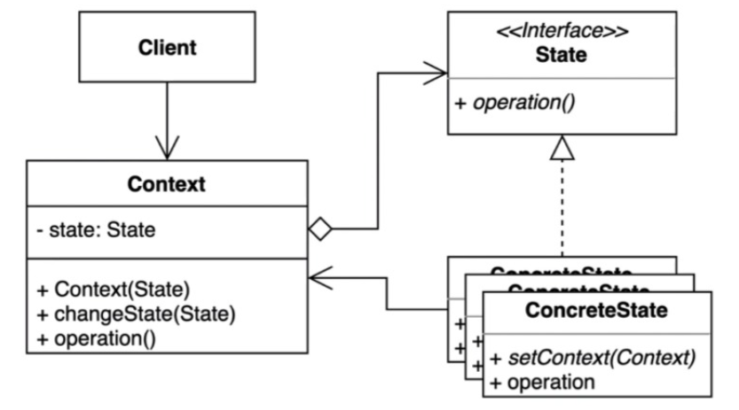

> ### 행동 관련 디자인 패턴

## 상태 패턴 ( State Pattern )

---

객체 내부 상태 변경에 따라 객체의 행동이 달라지는 패턴

> 상태에 특화된 행동들을 분리해 낼 수 있으며, 새로운 행동을 추가하더라도 다른 행동에 영향을 주지 않는다.

### ⭐ State
> 구현할 상태에 변화를 줄 기능을 추상화 한다. sample 영상에서는 addReview와 addStudent 해당.

### ⭐ ConcreteState
> State를 상속받아 구현한 상태 클래스를 의미 상태에 따른 처리를 각각 class가 책임가지고 있음.

---

상태패턴의 장점과 단점

장점

 - 상태에 따른 동작을 개별 클래스로 옮겨서 관리 가능. (가장 큰 장점. SRP )
 - 기존의 특정 상태에 따른 동작을 변경하지 않고 새로운 상태에 다른 동작을 추가 가능 ( Draft, Private 등등)
 - 코드 복잡도를 줄일 수 있다. ( 개별 클래스가 관리 )

단점
 - 복잡도가 증가한다 ( 상태에 따른 파일 증가 )

--- 

### ⭐ Enum 클래스를 사용해서 처리하면 되는거 아닌가 ??

개인적인 생각으로는 Enum으로 작성하게 될경우 새로운 상태가 추가됨에 따라 기존의 Enum 클래스의 수정이 들어가며
if~else를 통해 조건 분기로 상태를 처리하게 된다. 

수많은 분기로 처리하게된다면 OCP를 준수하지 못한다. 상태가 많아질수록 복잡해지고 그만큼 코드 변경이 어렵기 때문에
해당 패턴을 적용하면 좋을거 같다고 생각합니다.
