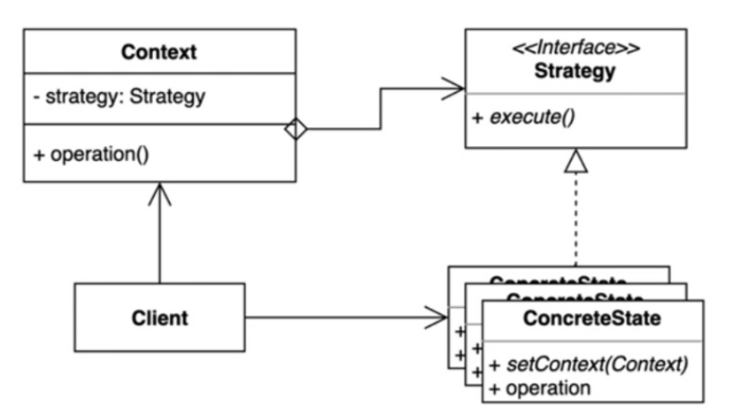

> ### 행동 관련 디자인 패턴

## 전략 패턴 ( Strategy Pattern )

---

여러 알고리즘을 캡슐화하고 상호 교환이 가능하게 만드는 패턴.

### ⭐ Strategy
> 상호교환 하기 위해 필요한 메소드를 가지고 있는 Interface 를 의미 
> 강의에서는 Speed interface를 의미.

### ⭐ ConcreteState 
> Strategy interface 를 상속받아 해당 메서드를 구현한 상호 교환 가능한 class를 의미.  
> 강의에서는 Normal, Fastest 등의 class를 의미.

### ⭐ Context
> 전략 패턴을 이용하는 역할을 수행하는 클래스, 동적으로 구체적인 전략을 바꿀 수 있도록 전략의 변경할 수 있는 메소드를 제공 . 
> 강의에서는 BlueLightRedLight 클래스를 의미

---

전략 패턴의 장,단점

장점

 - 새로운 전략을 추가하더라도 기존 코드를 변경하지 않는다 ( OCP를 만족한다 )
 - 상속 대신 위임을 사용할 수 있다.
 - 런타임시에 전략을 동적으로 변경할 수 있다.

단점

 - 복잡도가 증가한다.
 - 클라이언트 코드가 구체적인 전략을 알아야 한다.

---

Java, Spring 에 적용된 전략패턴

 - Comparator ( Java )
 - Spring 에서는 Interface를 제공한다면 대부분이 다 전략 패턴이다
   - 대표적으로 ApplicationContext 
 - BeanDefinitionParser
 - PlatformTransactionManager
 - CacheManager